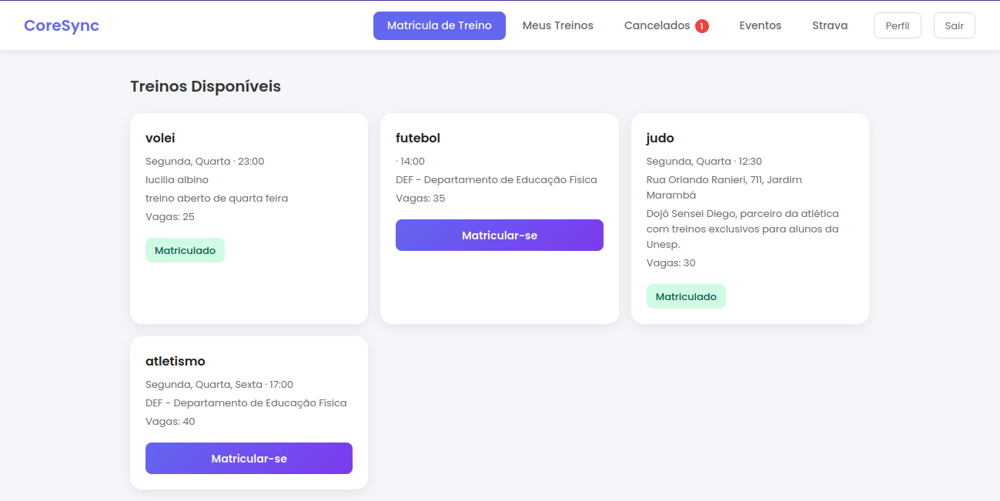
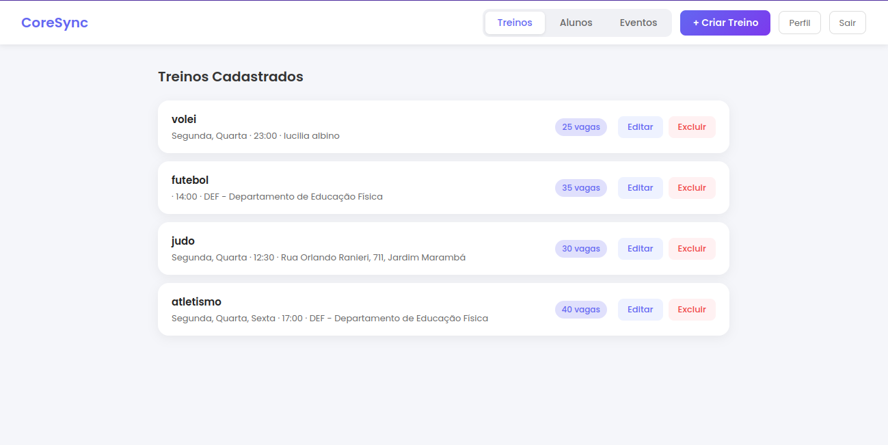
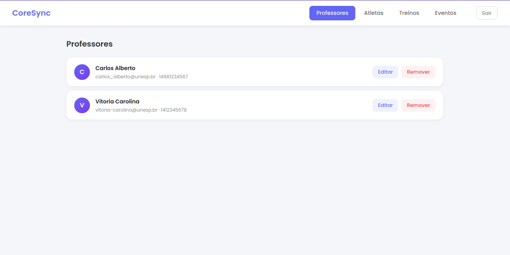
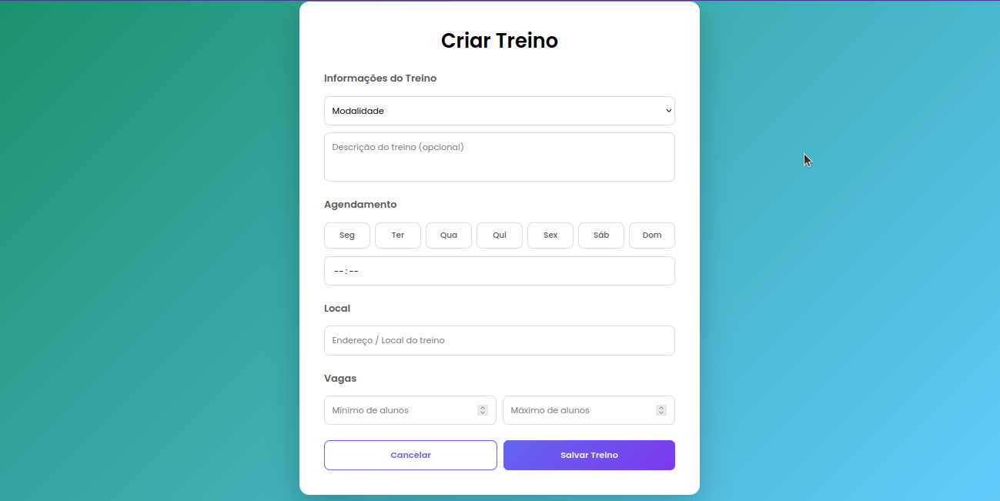

# CoreSync — Plataforma de Gerenciamento Esportivo


Sistema web para gerenciamento de treinos, eventos esportivos e chaveamentos de torneio. Conecta alunos, professores e administradores em um único ambiente, com integração à plataforma Strava para sincronização de atividades físicas.

> Projeto desenvolvido como Trabalho de Conclusão de Curso (TCC).

---

## Sumário

- [Sobre o Projeto](#sobre-o-projeto)
- [Funcionalidades](#funcionalidades)
- [Tech Stack](#tech-stack)
- [Estrutura de Pastas](#estrutura-de-pastas)
- [Instalação e Execução](#instalação-e-execução)
- [Variáveis de Ambiente](#variáveis-de-ambiente)
- [Rotas da Aplicação](#rotas-da-aplicação)
- [Screenshots](#screenshots)
- [Backend](#backend)
- [Autora](#autora)

---

## Sobre o Projeto

O **CoreSync** é uma plataforma web voltada para academias e associações esportivas. O sistema permite que professores gerenciem turmas de treino e eventos competitivos, enquanto alunos acompanham suas atividades e se inscrevem nas modalidades disponíveis. Administradores têm visão completa da plataforma e gerenciam chaveamentos de torneio.

---

## Funcionalidades

### Aluno
- Login e cadastro na plataforma
- Visualizar treinos disponíveis e se inscrever/desinscrever
- Visualizar eventos e confirmar presença
- Conectar conta do Strava e sincronizar atividades físicas
- Editar perfil pessoal

### Professor
- Criar, editar e desativar treinos (modalidade, horário, local, vagas, dias da semana)
- Criar e editar eventos esportivos
- Visualizar inscrições em treinos e eventos

### Admin
- Painel administrativo com visão geral da plataforma
- Gerenciar usuários
- Criar e gerenciar chaveamentos de torneio (simples, duplo, round-robin)
- Associar chaveamentos a eventos

---

## Tech Stack

| Camada | Tecnologia |
|--------|-----------|
| Framework UI | React 19 |
| Linguagem | TypeScript 5 |
| Build tool | Vite 7 |
| Roteamento | React Router DOM v7 |
| HTTP | Fetch API nativa + JWT Bearer |
| Estilização | CSS puro com custom properties |
| Integração externa | Strava API |

---

## Estrutura de Pastas

```
src/
├── components/         # Componentes reutilizáveis
│   ├── BracketVisual/  # Visualização do chaveamento
│   ├── Button/
│   ├── Input/
│   ├── ProtectedRoute/ # Guarda de rotas autenticadas
│   └── Select/
├── contexts/
│   └── AuthContext.tsx # Estado global de autenticação
├── hooks/
│   └── useForm.ts      # Hook genérico para formulários
├── pages/              # Telas organizadas por funcionalidade
│   ├── Home/           # Login e cadastro
│   ├── StudentDashboard/
│   ├── ProfessorDashboard/
│   ├── AdminDashboard/
│   ├── CreateTraining/
│   ├── EditTraining/
│   ├── CreateEvent/
│   ├── EditEvent/
│   ├── EventDetail/
│   └── ProfilePage/
├── services/           # Camada de comunicação com a API
│   ├── api.ts          # Cliente HTTP base
│   ├── auth.service.ts
│   ├── event.service.ts
│   ├── eventRegistration.service.ts
│   ├── strava.service.ts
│   ├── tournamentBracket.service.ts
│   ├── training.service.ts
│   └── user.service.ts
├── styles/             # Variáveis CSS e estilos globais de componentes
├── types/
│   └── index.ts        # Interfaces TypeScript do domínio
└── utils/
    └── token.ts        # Helpers para JWT no localStorage
```

---

## Instalação e Execução

### Pré-requisitos

- Node.js >= 18
- npm >= 9

### Passos

```bash
# 1. Clone o repositório
git clone <url-do-repositorio>
cd CoreSyncWeb

# 2. Instale as dependências
npm install

# 3. Configure as variáveis de ambiente
cp .env.example .env
# Edite o arquivo .env conforme a seção abaixo

# 4. Inicie o servidor de desenvolvimento
npm run dev
```

### Scripts disponíveis

| Script | Descrição |
|--------|-----------|
| `npm run dev` | Inicia o servidor de desenvolvimento com HMR |
| `npm run build` | Compila TypeScript e gera o bundle de produção em `dist/` |
| `npm run preview` | Serve o bundle de produção localmente |
| `npm run lint` | Executa o ESLint |

---

## Variáveis de Ambiente

Crie um arquivo `.env` na raiz do projeto com as seguintes variáveis:

```env
VITE_API_URL=http://localhost:3000
```

| Variável | Descrição |
|----------|-----------|
| `VITE_API_URL` | URL base da API REST backend |

---

## Rotas da Aplicação

| Rota | Página | Acesso |
|------|--------|--------|
| `/` | Home (login / cadastro) | Público |
| `/dashboard` | Redireciona conforme o papel do usuário | Autenticado |
| `/dashboard/atleta` | Dashboard do Aluno | Aluno |
| `/dashboard/professor` | Dashboard do Professor | Professor |
| `/dashboard/admin` | Dashboard Administrativo | Admin |
| `/criar-treino` | Criar Treino | Professor |
| `/editar-treino/:id` | Editar Treino | Professor |
| `/criar-evento` | Criar Evento | Professor |
| `/editar-evento/:id` | Editar Evento | Professor |
| `/evento/:id` | Detalhes do Evento | Autenticado |
| `/perfil` | Perfil do Usuário | Autenticado |

---

## Screenshots

> Prints das principais telas da aplicação.

<!-- Dashboard do Aluno -->
# Dashboard do Atleta

<!-- Dashboard do Professor -->
# Dashboard do Professor

<!-- Dashboard do Admin -->
# Dashboard do Administrador

<!-- Tela de Criação de Treino -->
# Tela de Criação de Treino


---

## Backend

O CoreSync possui uma API REST separada que gerencia toda a lógica de negócio e persistência de dados. O link do repositório será disponibilizado em breve.

---

## Autora

Desenvolvido por **Maria Alice** como Trabalho de Conclusão de Curso.

<!-- Instituição: UNESP "Júlio de Mesquita Filho" -->
<!-- Orientador(a): Higor Amario de Souza-->
<!-- Ano: 2026 -->
